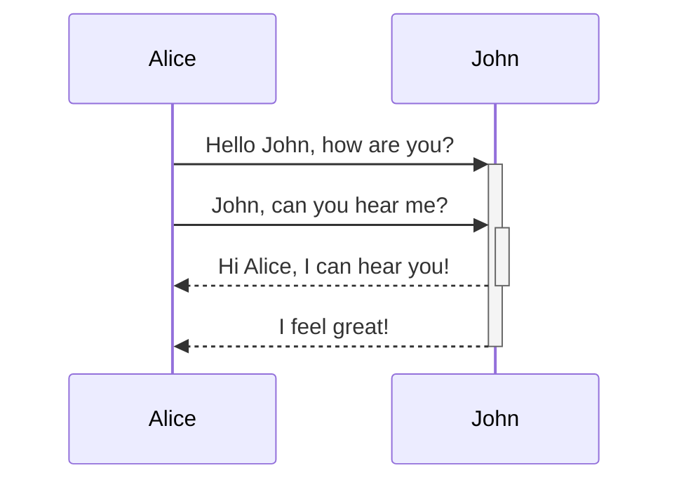

# Headers `h1`/`h2`/`h3`/`h4`/`h5`/`h6`

# h1

## h2

### h3

#### h4

##### h5

###### h6

---

# Text `i`/`b`/`code`/`s`/`mark`/`ins`/`sup`/`sub`/`abbr`/`kbd`

| Element | MD | Output | HTML | Output
| :- | :- | :- | :- | :-
| [italic] | `*italic*` | *italic* | `<i>` | <i>italic</i>
| [bold] | `**bold**` | **bold** | `<b>` | <b>bold</b>
| [code] | `` `code` `` | `code` | `<code>` | <code>code</code>
| [strikethrough] | `~~strikethrough~~` | ~~strikethrough~~ | `<s>` | <s>strikethrough</s>
| [mark] | `==mark==` | ==mark== | `<mark>` | <mark>mark</mark>
| [ins] | `++ins++` | ++ins++ | `<ins>` | <ins>ins</ins>
| [sup] | `^sup^` | a^sup^ | `<sup>` | a<sup>sup</sup>
| [sub] | `~sub~` | a~sub~ | `<sub>` | a<sub>sub</sub>
| [abbr] | `*[word]: Text` | word | `<abbr>` | <abbr title="Abbreviation">abbr</abbr>
| [kbd] |  |  | `<kbd>` | <kbd>kbd</kbd>

[italic]: https://developer.mozilla.org/en-US/docs/Web/HTML/Element/i "The Idiomatic Text element"
[bold]: https://developer.mozilla.org/en-US/docs/Web/HTML/Element/b "The Bring Attention To element"
[code]: https://developer.mozilla.org/en-US/docs/Web/HTML/Element/code "The Inline Code element"
[strikethrough]: https://developer.mozilla.org/en-US/docs/Web/HTML/Element/s "The Strikethrough element"
[mark]: https://developer.mozilla.org/en-US/docs/Web/HTML/Element/mark "The Mark Text element"
[ins]: https://developer.mozilla.org/en-US/docs/Web/HTML/Element/ins "The Inserted Text element"
[sup]: https://developer.mozilla.org/en-US/docs/Web/HTML/Element/sup "The Superscript element"
[sub]: https://developer.mozilla.org/en-US/docs/Web/HTML/Element/sub "The Subscript element"
[abbr]: https://developer.mozilla.org/en-US/docs/Web/HTML/Element/abbr "The Abbreviation element"
[kbd]: https://developer.mozilla.org/en-US/docs/Web/HTML/Element/kbd "The Keyboard Input element"

*[word]: Text

# Line Breaks `br`

> Line 1
> Line 2
> Line 3

> CJK:
> あおえ
> うい

# Typography

- ellipsis ...
- single 'quotes'
- double "quotes"
- dash --
- symbols (c) (C) (r) (R) (tm) (TM) +-

# Blockquote `blockquote`

> paragraph
>
> paragraph

> nested
>> block
> > > quotes

# Link `a`

- github.com • https://github.com • <https://github.com>
- someone@email.com • <someone@email.com>
- [inline](https://github.com/simov/markdown-viewer "Markdown Viewer")
- [referenced] • [referenced][referenced]

[referenced]: https://github.com/simov/markdown-viewer "Markdown Viewer"

# List `ul`/`ol`/`li`

- ul
  - ul
    - ul

1. ol
2. ol
3. ol

# Table `table`/`thead`/`th`/`tbody`/`tr`/`td`

| default      | left            | centered           | right
| ---          | :---            | :---:              | ---:
| default      | align left      | centered           | align right
| default left | align left left | centered centered  | align right right
| default      | align left      | centered           | align right

# Definition List `dl`/`dt`/`dd`

Type
: Extension

Name
: Markdown Viewer

<dl>
  <dt>Type</dt>
  <dd>Extension</dd>
  <dt>Name</dt>
  <dd>Markdown Viewer</dd>
</dl>

# Task List

- [x] task
- [ ] task

# Footnotes

Something something[^named]

And something else[^1], and a link[^2]


[^1]: This reference footnote contains a paragraph...

    * ...and a list

[^2]: https://github.com/simov/markdown-viewer
[^named]: https://github.com/simov/markdown-viewer

# Image `img`


[](https://github.com/simov/markdown-viewer)

# Code Block `pre`

```
fenced code block using backticks
```

```js
var foo = 'syntax highlighting using Prism.js'
```



# Emoji

:smile:

# MathJax

$$
J(\theta) = - \frac{1}{m} \sum_{i=1}^m [ y^{(i)}\ \log (h_\theta (x^{(i)})) + (1 - y^{(i)})\ \log (1 - h_\theta(x^{(i)}))] + \frac{\lambda}{2m}\sum_{j=1}^n \theta_j^2
$$

# MathML `math`

<p>
When
<math xmlns="http://www.w3.org/1998/Math/MathML">
  <mi>a</mi><mo>&#x2260;</mo><mn>0</mn>
</math>,
there are two solutions to
<math xmlns="http://www.w3.org/1998/Math/MathML">
  <mi>a</mi><msup><mi>x</mi><mn>2</mn></msup>
  <mo>+</mo> <mi>b</mi><mi>x</mi>
  <mo>+</mo> <mi>c</mi> <mo>=</mo> <mn>0</mn>
</math>
and they are
<math xmlns="http://www.w3.org/1998/Math/MathML" display="block">
  <mi>x</mi> <mo>=</mo>
  <mrow>
    <mfrac>
      <mrow>
        <mo>&#x2212;</mo>
        <mi>b</mi>
        <mo>&#x00B1;</mo>
        <msqrt>
          <msup><mi>b</mi><mn>2</mn></msup>
          <mo>&#x2212;</mo>
          <mn>4</mn><mi>a</mi><mi>c</mi>
        </msqrt>
      </mrow>
      <mrow>
        <mn>2</mn><mi>a</mi>
      </mrow>
    </mfrac>
  </mrow>
  <mtext>.</mtext>
</math>
</p>

# Details `details`/`summary`

<details open><summary>Open by Default</summary>

- [x] task
- [ ] task

</details>

<details><summary>Click to Expand</summary>

```js
var code = 'block'
```

### Inner Header

[link](https://github.com/simov/markdown-viewer)

</details>

# Custom Attributes

#### Check out this header id {#foo}

---

# Styles

## CSS

<p style="text-decoration: underline;">Underline</p>

## Link

- [regular][url]
- [*italic*][url]
- [**bold**][url] • [***bold italic***][url]
- [`code`][url] • *[`code italic`][url]* • **[`code bold`][url]** • ***[`code bold italic`][url]***

  [url]: https://github.com/simov/markdown-viewer

## Inline Code

- `regular`

- *`italic`*

- **`bold`** • ***`bold italic`***

## Blockquotes

> regular

> _italic_

> **bold**

> `code`

> **`code bold`**

> ***`code bold italic`***

## Strikethrough

- ~~regular~~
- ~~_italic_~~
- ~~**bold**~~ • ~~***bold italic***~~
- ~~`code`~~ • ~~_`code italic`_~~ • ~~***`code bold italic`***~~

> ~~***`code bold italic`***~~

---

# Example Text

Nullam quis risus eget [urna mollis ornare]() vel eu leo. Cum sociis natoque penatibus et magnis dis parturient montes, nascetur `ridiculus` mus. Nullam id dolor id nibh ~~ultricies vehicula~~.

The following is **rendered as bold text**.

The following is *rendered as italicized text*.

```
fenced code block using backticks
```

> This is a blockquote Lorem ipsum dolor sit amet, consectetur adipiscing elit. Integer posuere erat a ante.

- Nullam congue mollis metus
- Donec massa sapien
- Tristique ac metus sit amet

1. Nullam congue mollis metus
2. Donec massa sapien
3. Tristique ac metus sit amet

| Name | Score | Time
| :-   | :-:   | -:
| John | 24    | 55s
| Doe  | 1135  | 2m:15s
| Duh  | 1     | 5s

---
